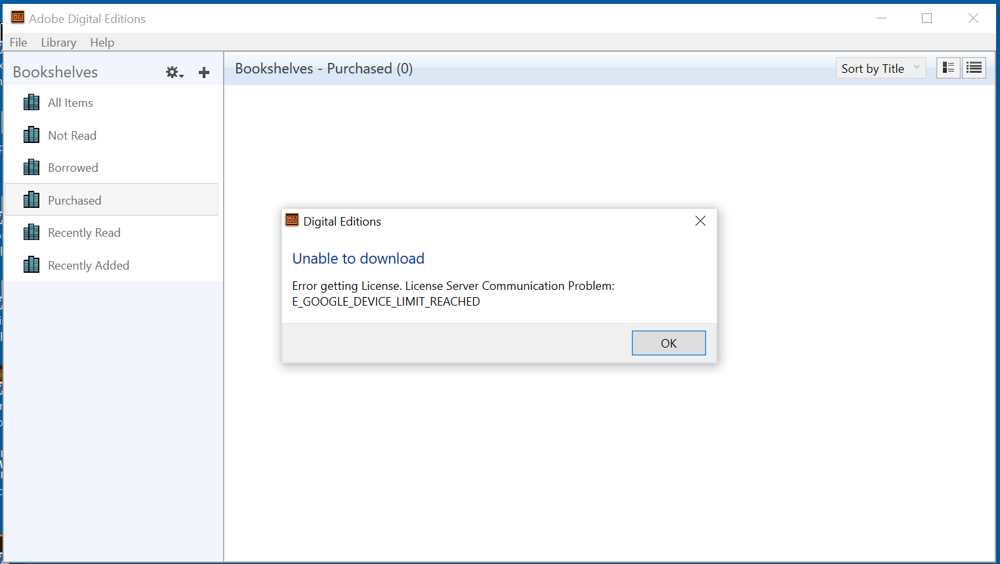
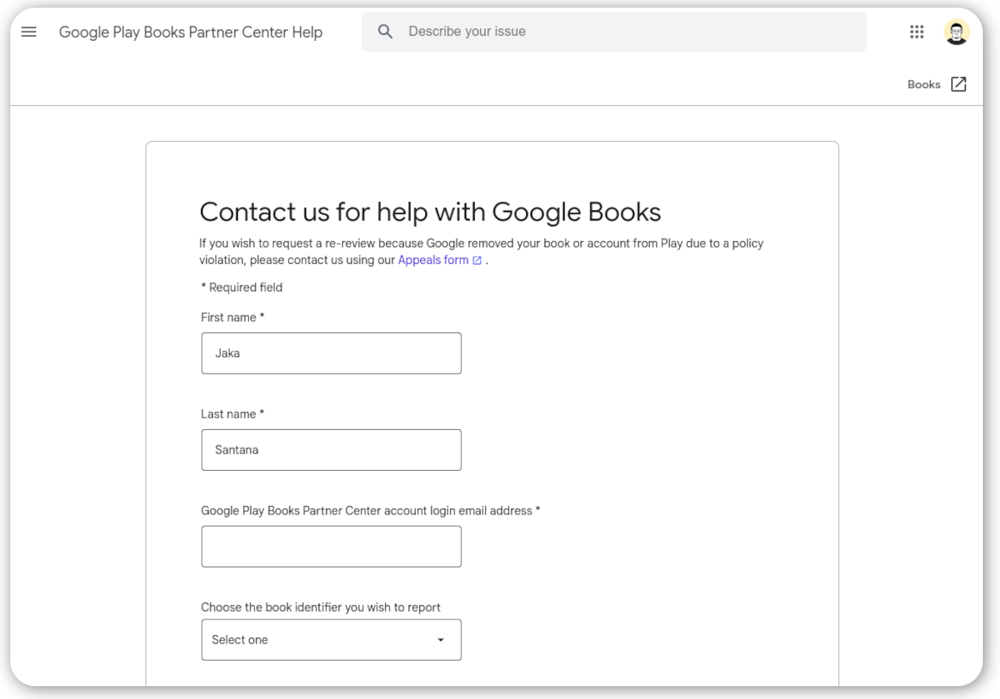

Kalau kamu tak sengaja memasukkan file .acsm ke dalam Adobe Digital Editions tanpa authorizarion ke Adobe ID, dan akhirnya kamu mendapati error seperti ini:

`E_GOOGLE_DEVICE_LIMIT_REACHED`

atau

`E_LIC_ALREADY_FULFILLED_BY_ANOTHER_USER`

Jangan khawatir. 

Kamu bisa meminta support Google untuk mereset token Download eBook-mu di Google Play Books, caranya cukup kunjungi [halaman Google Book Partner ini](https://support.google.com/books/partner/contact/default). 

Setelah itu masukkan beberapa informasi penting terkait permasalahan yang kamu alami, masukkan data nama, email yang kamu gunakan saat membeli ebook tersebut, keterangan buku ISBN atau GGKEY (ISBN bisa kamu cek dengan membuka link ebooknya, ada di keterangan di bawah dari halaman), isi keterangan tambahan, dan Upload screenshot tampilan error saat kamu tak bisa memasukkan buku tadi ke Adobe Digital Editions.

Saya sendiri memerlukan waktu satu hari hingga kemudian ada balasan dari support google kalau token download bukunya sudah direset. Padahal sebelumnya saya protes melalui halaman [My Books](https://play.google.com/books), dan panjang lebar menjelaskan ke support tersebut tanpa ada jawaban yang memuaskan. Hingga akhirnya saya tau cara untuk reset token ini 🙈.