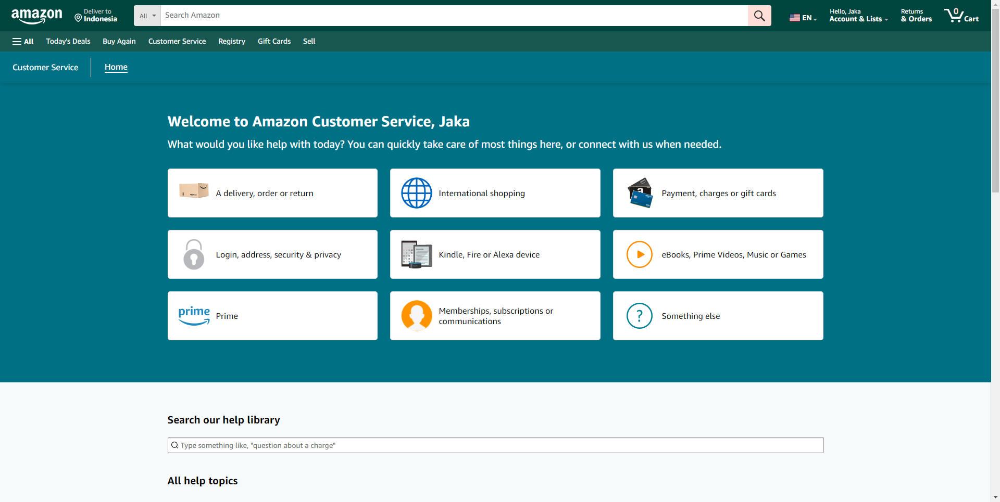
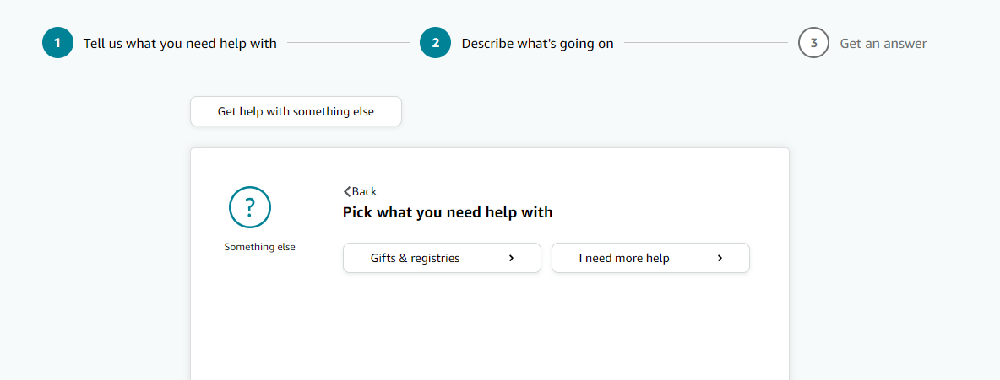
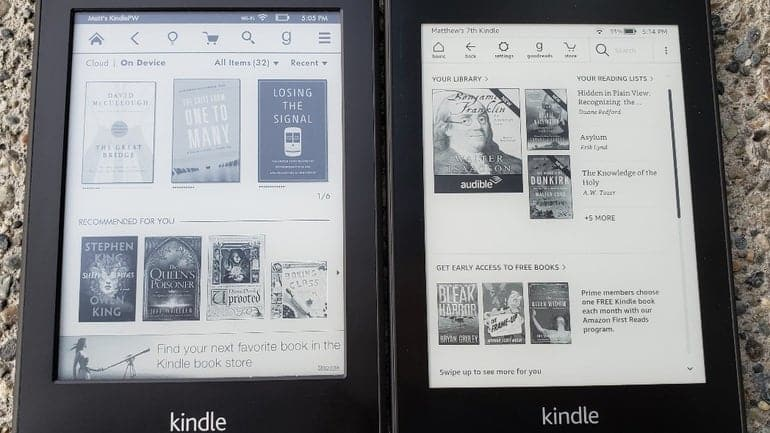
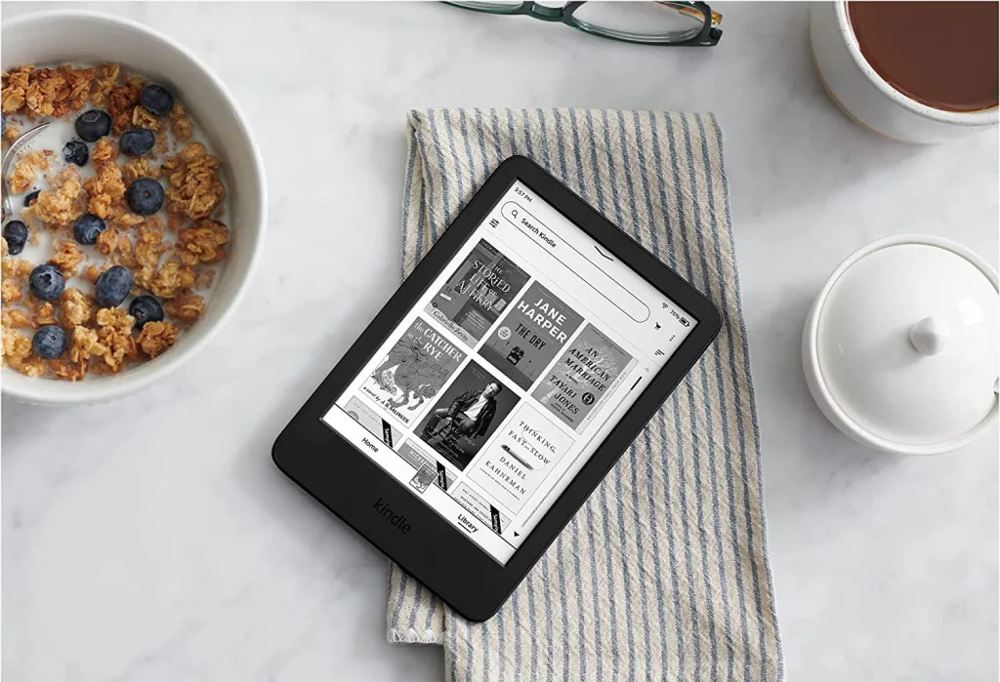

Semenjak dibeliin Kindle Basic Gen 10 dari Adik tersayang, saya ga pernah registrasiin kindle tersebut ke Amazon. Buku-buku di library Kindle saya itu kebanyakan saya beli dari store lain, seperti Google playbook, Kobo, dan beberapa ebook yang didapat bukan dari Store online. 

Buku-buku tersebut saya transfer menggunakan [Calibre](https://calibre-ebook.com/). 

Nah beberapa hari sebelum Istri saya mau jalan ke Jepang dan bakal meminjem Kindle saya itu, saya coba-coba buat registrasiin Kindle tersebut ke Amazon, kali aja ada penawaran buku gratis dari Amazon, jadi bisa saya langsung transfer ke Kindle saya itu tanpa menggunakan Calibre.

Elah dalah... 

Ternyata Kindle saya itu dapet 'Special Offers' dari Amazon, semacam iklan buku yang sedang promo atau sedang didiskon di Amazon. 

Adanya iklan itu cukup mengganggu karena cover Kindlenya jadi cover iklan, dan di tampilan library buku ada Banner Special Offers di bawah. 

Ga terlalu gede tapi tetep mengganggu aja. 

Meh.. 🤬

Setelah Googling nyari cara buat ngehapus special offers tanpa membayar sekitar $20, ternyata ada cara simple dan pasti buat ngehapus special offers tersebut tanpa bayar. [Thanks reddit](https://old.reddit.com/r/kindle/comments/8qx742/removing_ads_the_easy_way/) 🫣.

# TL;DR

Caranya adalah tinggal menghubungi CS Amazon melalui chat yang bisa dikunjungi di [halaman ini](https://www.amazon.com/hz/contact-us/foresight/hubgateway).

Kemudian pilih Something else dan pilih 'I need more help'. Setelah itu akan ada tombol untuk chat langsung dengan Customer Service Amazon. 

Awalnya akan ada beberapa pilihan sebelum bisa chat langsung, pilih aja (kalo ga ada), ketik special offers atau remove special offers. 

Setelah nanti bisa ngobrol sama CSnya, tulis aja alasan kita mau ngehapus special offers itu karena Kindlenya mau dipake buat anak-anak dan takut kepencet iklan special offersnya.

Nanti CSnya akan menanyakan Serial Number dari Kindlenya, setelah itu menanyakan beberapa pertanyaan yang berhubungan dengan billing. 

Bla bla bla dan viola, Special Offersnya dihapusin oleh CSnya, dan setelah dihapus gitu nanti tinggal restart aja Kindlenya.👌

Kalau udah registrasi, kita bisa update tampilan kindlenya jadi lebih bagus kayak gini:

