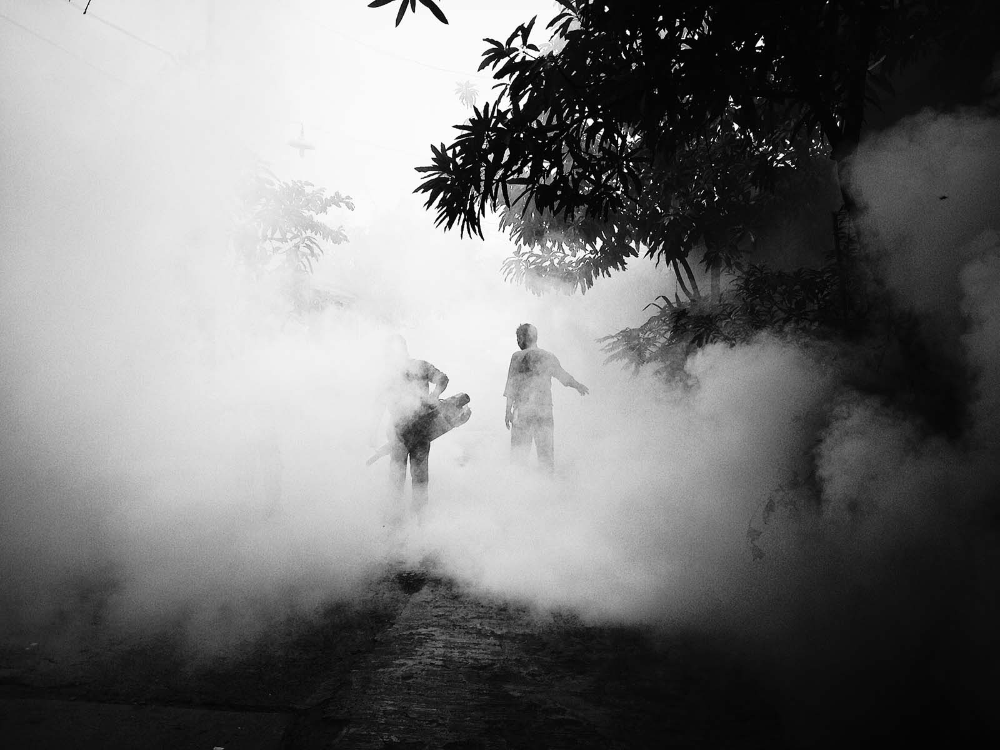
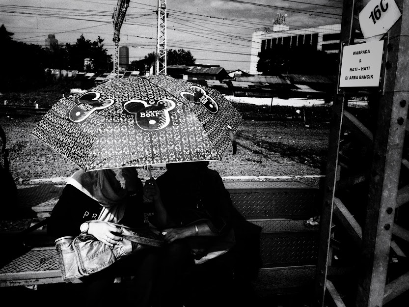
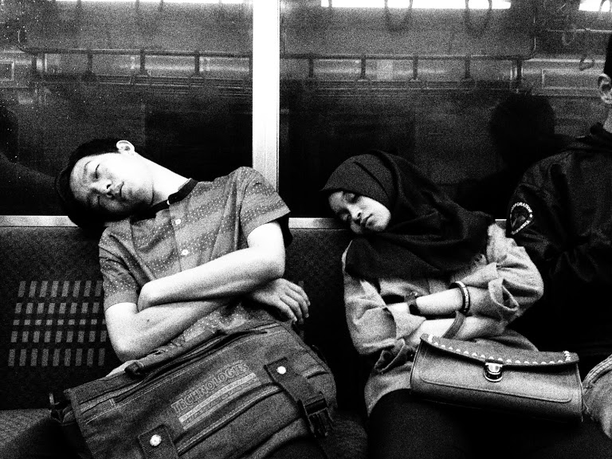
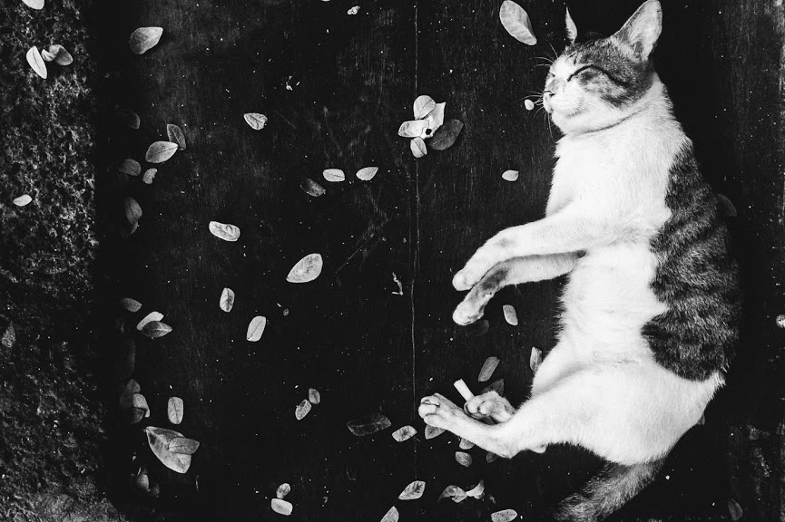

Sebelumnya saya selalu skeptis terhadap kamera smartphone, bahkan dulu waktu saya punya iPhone 4, saya tidak terlalu menganggap serius fitur kameranya. Saya hanya menggunakan kamera iPhone 4 dulu untuk memotret dokumen, hal-hal yang perlu diingat, pokoknya waktu itu saya tidak serius menggunakan kamera iPhone 4 untuk memotret sebagai pengganti DSRL, bahkan untuk memotret *street photography*.

Sampai akhirnya saya banyak mengenal fotografer atau mentor fotografi yang menggunakan iPhone-nya untuk memotret sehari-hari dan bahkan untuk memotret *street photography*, seperti [Olly Lang](http://oggsie.com/oggsie) dan [Josh White](https://jtinseoul.wordpress.com/). Sebenarnya ada banyak fotografer yang juga menggunakan smartphone untuk fokus memotret di jalanan, namun kedua orang inilah yang paling menginspirasi saya untuk fokus memotret *street photography* menggunakan smartphone. 

## Mengapa iPhone 5?

Kenapa saya menggunakan iPhone 5? Padahal ada smartphone android yang harga secondnya lebih murah dibandingkan iPhone 5, namun memiliki kualitas hasil foto yang sama atau malah lebih. Bagi saya pribadi, saya memilih iPhone 5 karena ukurannya yang kecil, dan sangat pas untuk masuk ke kantong celana atau dada. Sehingga proses memotret sangatlah cepat.

Selain itu saya memilih iPhone 5 karena aplikasi iOS, atau aplikasi kamera bawaannya sangat mudah digunakan, tidak ada masalah (lagging atau hal lainnya), dan fiturnya sudah sangat familiar bagi saya (karena saya sudah menggunakan iPhone 3GS dan 4 sebelumnya). Tapi dari semua alasan tersebut, tentu saja nomor satunya karena budget.

## Fitur iPhone 5

Kamera depan iPhone 5 mampu memotret gambar jpeg dengan resolusi 8 megapiksel dan focal length 4.12mm atau setara dengan 33mm (pada sistem 35mm). Pada iPhone 5, pengaturan ISO, shutter speed, kompensasi exposure, white balance dan fokus bisa secara manual namun tidak melalui aplikasi kamera bawaannya. Supaya kamu bisa mengatur secara manual pengaturan yang dijelaskan tadi, perlu aplikasi third party seperti [Manual](http://shootmanual.co/).

Hal menarik dari iPhone 5 ini adalah, kamu bisa menggunakan tombol volume pada hapenya dan pada headset apple yang ada mic plus pengaturan volumenya sebagai tombol shutter, ini bermanfaat apabila kamu ingin memotret dari posisi yang agak sulit, seperti dari bawah pinggang, atau di atas kepala. Kamu juga bisa mengurangi shaking dengan menggunakan tombol volume headset apple sebagai tombol shutter.

Shutter lag pada iPhone 5 kalau saya rasakan sendiri tergolong rendah, namun pada aplikasi third party sebenarnya shutter lag juga terasa tidak terlalu tinggi. Biasanya yang membuat lama adalah ketika membuka aplikasi third party. Berbeda dengan membuka aplikasi kamera bawaannya, ada banyak shortcut supaya kamu bisa dengan cepat membuka aplikasi tersebut.

Autofokus iPhone 5 juga tergolong cepat, menurut saya. Namun apabila kondisi kurang cahaya seperti di dalam ruangan atau malam hari, kadang autofokusnya agak lambat, hal ini memang lumrah terjadi di hampir setiap smartphone atau kamera digital lainnya.

Kalau ngobrolin fitur aplikasi kamera bawaan, sebenarnya aplikasi bawaan iPhone 5, lebih tepatnya aplikasi kamera iOS (terakhir di iOS 10), aplikasi bawaan iPhone 5 ini sudah sangat bagus untuk dipakai memotret, apalagi memotret *street photography* yang membutuhkan kecepatan. Saya malahan sangat jarang memotret menggunakan aplikasi third party-nya. Biasanya aplikasi third party ini saya gunakan untuk mendapatkan foto yang tertentu, seperti long exposure.  

## Pengalaman menggunakan iPhone 5

Menggunakan iPhone 5 untuk memotret, terutama memotret street photograhy, benar-benar mudah, tinggal point and shoot (literally). Apalagi karena ukurannya yang kecil di kantong, sehingga tidak terlalu besar apabila disimpan di kantong dada. Sewaktu-waktu bisa langsung digunakan untuk memotret karena mudah dimasuk atau keluar kantong, juga karena ada shortcut menuju aplikasi kamera, sehingga kesiapan memotret bisa lebih cepat.

Memotret menggunakan iPhone 5 di keramaian juga sangat mudah, biasanya orang tidak begitu peduli karena dipikir hanya orang awam yang mau memotret. Namun karena dipikir orang awam, jadi kalau mau meminta foto portrait, bisa-bisa saya dianggap cabul.

Karena baterai iPhone 5 ini yang cukup kecil, apalagi kalau koneksi datanya saya nyalakan, maka cepat sekali baterainya habis. Hal ini bisa menjadi masalah kalau menggunakan smartphone ini untuk proyek foto seharian penuh. 

Karena hal itulah maka dianjurkan membawa powerbank apabila mau memotret seharian menggunakan iPhone 5. Namun menyarankan untuk tidak menggunakan smartphone ini ketika sedang melakukan pengisian daya.

## Kekurangan iPhone 5

Karena kamera iPhone 5 ini menggunakan sensor kecil dan pengolahan gambar tidak seperti yang ada pada kamera digital, maka sangat terasa dynamic range pada hasil kamera iPhone 5 ini cukup kecil atau pendek.

Noise juga sering muncul apabila memotret dengan kondisi kurang cahaya. Sayangnya noise pada iPhone 5 ini cukup banyak, bahkan ketika kondisi tidak gelap (namun masih kurang banyak cahaya).

Ada bug yang dimiliki semua kamera iPhone 5, yaitu flare ungu apabila kita memotret melawan cahaya matahari datang. Terkadang cahaya lampu juga menyebabkan flare ungu. Namun apabila kamu memotret BW, hal ini tidaklah menjadi masalah.

Hal yang terkadang menjadi masalah apabila memotret menggunakan iPhone 5 ini adalah baterainya yang cepet habis juga cepat sekali panas, apalagi kalau datanya diaktifkan untuk mengakses Internet.

Karena saya mereview dalam sudut pandang memotret *street photography*, maka dynamic range yang pendek juga noise bukanlah masalah. Justru saya terkadang mendapatkan foto yang bagus walaupun noisenya tinggi.

## Apakah kamu perlu membeli iPhone 5 untuk memotret Streetphotography?

Apabila kamu memiliki iPhone 4 atau 4s, dan tujuannya untuk memotret *street photography*, maka kamu tidak perlu membeli iPhone 5 ini, kecuali kamu memang ada budget dan berencana untuk mengupgrade smartphone, mungkin kamu bisa membeli seri di atas iPhone 5, seperti iPhone SE, atau iPhone 7.

Saya kurang merekomendasikan mengupgrade ke iPhone 6 atau 6plus apabila kamu mau menggunakannya untuk memotret *street photography*, karena ukurannya yang 'terlalu besar' untuk digenggam dan dimasukkan ke saku.

Apabila kamu menggunakan smartphone android, dan memiliki shutter lag juga autofokus yang rendah atau cepat, maka kamu tidak pelu membeli iPhone 5 ini.

Terakhir, apabila kamu memiliki kamera poket (*point and shoot*) yang *shutter lag* rendah, dan bisa manual fokus, maka kamu juga tidak perlu membeli iPhone 5 ini. Kalaupun ada budget, dan kamu mau fokus memotret *street photography*, saya menyarankan menggupgrade kamera digital poket yang ada manual fokus (atau snap fokus seperti Ricoh GR), lebih bagus lagi kalau lensanya fix (tidak bisa zoom).