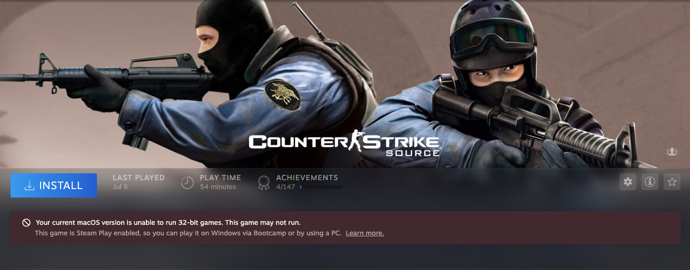
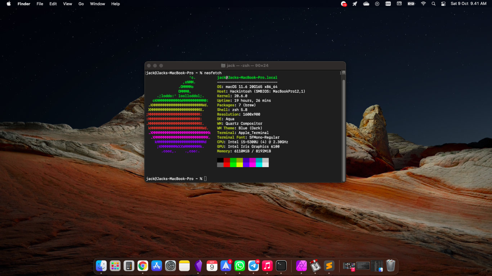

Setelah cukup lama menimbang-nimbang untuk menginstall Hackintosh di Thinkpad X250 saya, dan juga cukup banyak orang yang sudah [mencobanya](https://github.com/exxncss/x250-hackintosh) (thanks mas bro exxncss), sayapun memberanikan diri mencoba OS ini.

Tidak tanggung-tanggung, saya langsung menginstall Big Sur (macOS 11). 

Sedikit rasa menyesal, karena ternyata [Big Sur tidak mendukung aplikasi 32 bit](https://support.apple.com/en-us/HT208436), artinya banyak game steam saya yang ga bisa dimainin. Contohnya game Counterstrike Source ini. 🥲



## Apa yang ga berfungsi?

- **Bluetooth**. Chipset Intel AC-7265 sayangnya masih belum support untuk AirDrop maupun Handoff. Padahal cukup berguna kalau mau pindahin data besar tanpa kabel/sync ke iCloud.
- **Audio Bluetooth**. Sepertinya memang masih jadi bugnya dari chipset Intel AC-7265, kalau wifi tersambung jadinya suka tersendat-sendat. Kalau wifi off, audio bluetooth dari TWS saya ga ada masalah.
- **VGA port**. Vga port dari thinkpad x250 saya jadi ga kedetect, dan solusinya adalah menggunakan kabel tambahan display port ke hdmi. 
- **Card Reader**. Update, card reader bisa berfungsi setelah melalui step-step di artikel ini: [Fix Internal/External Card Reader Hackintosh Guide](https://noobsplanet.com/threads/32/)
- **Jack 35mm**. Ini kejadian yang jarang banget, audio dari jack 35mm kadang suka mati, dan solusinya adalah sleep dan bangunin laptopnya kembali. 

## Mau Coba Install Hackintosh? 

Cara paling mudah dipahami adalah:

- Menyiapkan instalan dan EFI untuk boot flashdisk, tutorialnya bisa dilihat [di sini](https://github.com/exxncss/x250-hackintosh#buat-installer-macos). Untuk bahan-bahan apabila di web Oralia engga bisa didownload, dari komunitas Hackintosh udah melakukan mirroring file recovery OS nya [di sini](https://drive.google.com/drive/u/2/folders/1nF71xPbhiyuS8vQOi-E6wHS-tSknvoZo).
- Melakukan instalasi mac (recovery macOS ke HDD/SSD kita). Tutorialnya bisa ditonton [di sini](https://www.youtube.com/watch?v=olBn3HQP4yc).
- Melakukan penyesuaian, patch, dll. Kalo ini bisa langsung ditanya aja ke grup/dm di forum, dll.

Kalau ada kesulitan, mentok, dll, bisa kunjungi ini saja.

- [Grup Telegram Hackintosh Indonesia](https://t.me/HackintoshLover)
- [Forum Tonymacx86](https://www.tonymacx86.com/)
- [Grup Facebook Hackintosh Indonesia](https://www.facebook.com/groups/hackintosh.indonesia)

## Apakah Worth it?

Pasti 😅, macOS itu enak banget. 

Experiencenya jauh banget dengan menggunakan windows dan linux. Untungnya udah biasa menggunakan terminal linux, jadi ga kagok pas pake terminal mac. 
