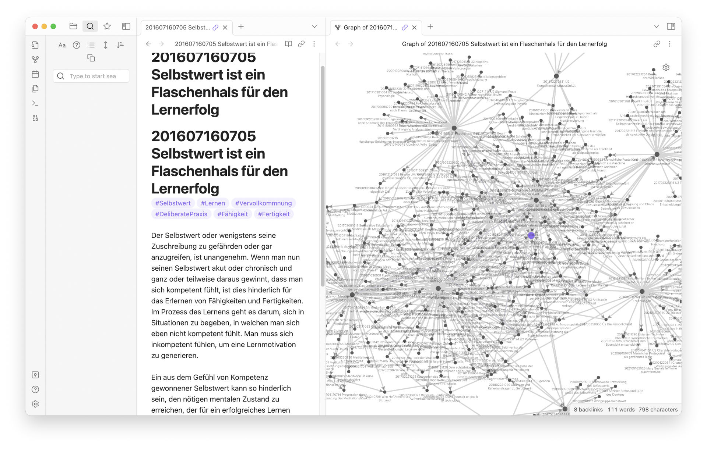

Walaupun [Hugo](https://gohugo.io/) sebagai Static Site Generator cukup mumpuni buat bikin web blogging, tapi menulis/ngeblog di editor Visual Studio Code atau IDE itu engga  nyaman buat saya, bahkan membingungkan ketika kita melihat source codenya doang seperti di bawah ini.


Supaya memudahkan saya menulis, saya menggunakan [Obsidian](https://obsidian.md/) untuk digunakan sebagai Content management systemnya. 

Obsidian ini sebenarnya digunakan untuk menulis notes bahkan ke tingkat yang lebih kompleks seperti pembuatan Graph view di bawah ini. Setiap catatan yang terhubung terlihat tampilan jaringannya. 



Versi terbaru Obsidian memberikan banyak kemudahan buat saya menjadikan CMS dari Hugo. 

Tampilan Obsidian memang cocok sekali dipakai bersamaan dengan Hugo, karena sama-sama menggunakan format markdown pada setiap notesnya.


Selain tampilan, ada beberapa alasan saya untuk menggunakan Obsidian sebagai CMS:
1. **Plugin.** Fitur melimpah untuk mempercepat menulis, banyak plugin yang bisa diinstall untuk mempermudah dan mempercepat penulisan menggunakan Markdown. Seperti pembuatan tabel (cukup sulit membuat tabel di Markdown kalo engga menggunakan tools).
2. **Spelling**, bisa menginstall beberapa bahasa untuk digunakan sebagai spelling check tulisan saya, saya menggunakan Inggris dan Bahasa Indonesia. Ini penting soalnya saya sering Typo.
3. **Fleksibel**, obsidian memungkinkan kita mengimpor gambar, tulisan html ke dalam bentuk format Markdown.

## Setup

Ada beberapa settingan supaya ngeblog di Obsidian makin memudahkan saya, settingannya saya jelaskan di bawah.

### Setting Vault Obsidian

Supaya saya tidak sengaja (karena kobodohan sendiri) mengacaukan file atau struktur folder yang ada di Hugo, jadi folder yang dibuka sebagai Vault di Obsidian hanya folder Content saja. 

Folder content ini biasanya cuman ada tulisan blog, halaman about, dan halaman-halaman berisi konten yang akan muncul di webstei.

Supaya settingan obsidian engga muncul di instalan Hugo, cukup abaikan folder setting Obsidian `.obsidian` dengan menambahkan beberapa baris di file `.gitignore`.

```
.obsidian
content/.obsidian
```

Tapi nantinya saya musti setup ulang Obsidiannya setiap pindah PC atau Laptop. 
### Setting Default Penyimpanan Gambar.

Fleksibilitas Obsidian yang bisa memindahkan (copas) tulisan html bahkan gambar ke dalam notesnya bisa kita setup supaya gambarnya masuk ke dalam folder gambar (saya menggunakan folder images), supaya mempercepat proses ngeblog tanpa harus copas manual di folder/explorer. 


Atur beberapa settingan ini di pengaturan Obsidian di section Files and Links:

1. **New Link Format**, ubah ke Relative path to file, supaya menghasilkan link simpel seperti: ``
3. Nonaktifkan Wikilinks
4. **Default location for new attachment**, ubah ke setting 'in subfolder under current folder'. 
5. **Subfolder Name**, sesuaikan dengan nama subfolder gambar, kalau saya menggunakan folder 'images', karena bawaan template. 

---

Karena GUI VS Code memudahkan saya untuk mengecek code apa saja yang beruba, Saya masih menggunakan/membuka VS Code.

Fitur source control di dalam VS Code memudahkan saya mengembalikan/ discard perubahan yang salah. 


Saya juga menjalankan Hugo di local menggunakan terminal VS Code untuk mengecek tampilan di websitenya secara local, apakah sudah sesuai apa belum.