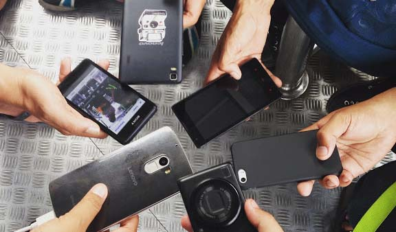
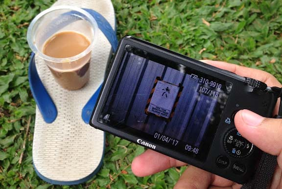
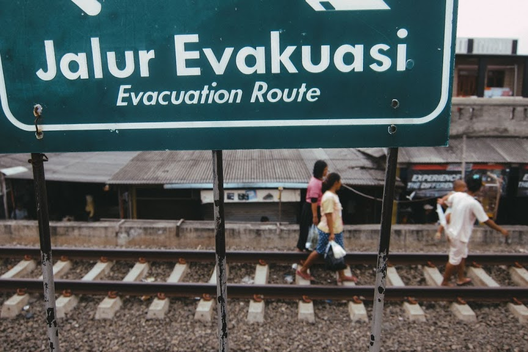
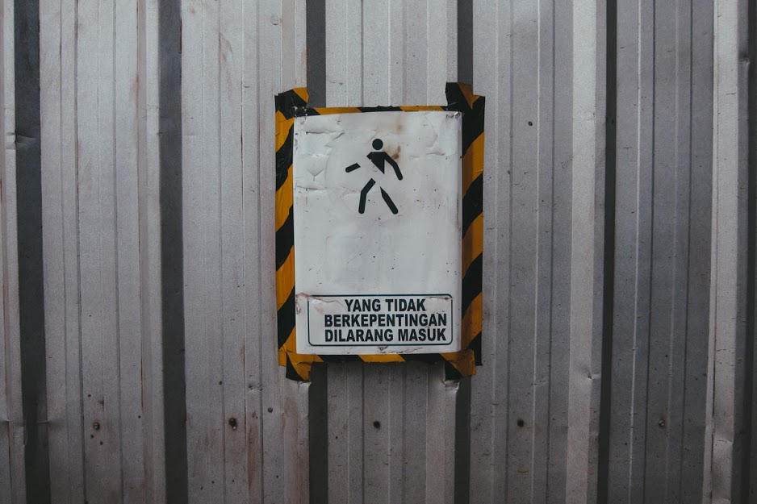
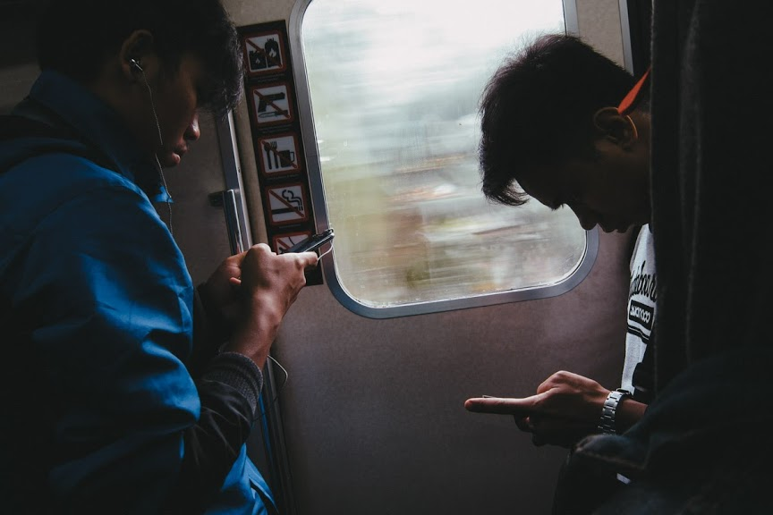

Tulisan ini merupakan hasil pengalaman saya memotret di 24 Hour Project tahun sebelumnya, dan juga berdasarkan keterangan fotografer-fotografer yang pada tahun-tahun sebelumnya sudah mengikuti kegiatan [24 Hour Project][https://www.24hourproject.org/] ini.

## Minimalkan Gear

Untuk memotret selama kurang lebih 24 jam, maka saya sarankan membawa kamera yang ringan. Apabila hanya ada kamera DSLR atau kamera Mirrorless, maka saya sarankan juga untuk menggunakan satu lensa saja, saya rekomendasikan lensa fix yang cukup lebar seperti 35mm atau lebih lebar lagi, dan memiliki bukaan yang cukup besar, misalnya f1.8. Karena bisa bermanfaat saat kondisi bercahaya kurang.  
  
Saya sendiri lebih merekomendasikan menggunakan kamera yang lebih kecil lagi, seperti kamera poket atau kamera Smartphone, namun karena smartphone juga dipakai untuk komunikasi dan kegiatan yang membutuhkan paket data Internet, maka kemungkinan smartphone kamu akan cepat habis baterainya. 

Saya sendiri menggunakan kamera poket [Canon S95](/blog/review-canon-s92-untuk-street-photography/) sebagai kamera utama dan [iPhone 5](/blog/iphone-5-untuk-street-photography/) sebagai kamera cadangan.  
  
Bicara soal cadangan, hal penting yang perlu disiapkan adalah daya tambahan, seperti powerbank dan baterai tambahan. Walaupun hanya diminta mengupload 24 foto terbaik, tidak ada salahnya untuk membawa memory cadangan. 

Tapi saya sendiri hanya cukup dengan 8GB SD card, karena saya hanya memotret sedikit, 8GB bagi saya lebih dari cukup untuk mendapatkan 24 foto terbaik.  
  
Supaya memudahkan transfer data dari kamera digital ke smartphone (untuk diunggah ke Instagram), saya lebih menyarankan menggunakan card reader yang bisa dipasang ke smartphone, daripada menggunakan SD Card ber-wifi, atau kamera yang memiliki wifi. Karena bakal menguras baterai cukup cepat apabila melakukan transfer foto menggunakan wifi.

Menurut saya membawa bawaan lebih ringan dan sedikit gear lebih baik, karena memudahkan untuk fokus pada memotret dan tidak cepat menguras stamina (karena hunting 24 jam).  

## Perlengkapan Penting Lainnya

Karena akan berjalan-jalan selama kurang lebih 24 jam, disarankan untuk menggunakan sepatu untuk jalan-jalan yang cukup nyaman, menggunakan sendal atau sepatu sendal akan cukup membuat kaki nyeri-nyeri. Apalagi kalau dilakukan di kota Jakarta, apabila cuaca tidak hujan, maka akan membuat kaki terbakar sinar matahari. Dan akan mengganggu kegiatan hunting foto 24 jam. Namun apabila tidak masalah, maka gunakan saja sendal atau sepatu sendal.  
  
Bawalah uang secukupnya, apabila memungkinkan, hindari membawa dokumen yang sangat penting, seperti kartu kredit, npwp, bpjs atau dokumen lain yang sebenarnya tidak perlu dibawa karena kita akan hunting foto selama kurang lebih 24 jam. 

Bawalah kartu identitas dan mungkin membawa kartu nama apabila ada pihak yang tertarik dengan apa yang sedang kita lakukan.  

## Menyiapkan Rute Perjalanan

Persiapkan rute perjalanan sedini mungkin, apabila memiliki grup untuk hunting saat hari H nanti, mungkin bisa dirumuskan rute perjalanan dengan grup beberapa hari sebelumnya, supaya juga bisa memperkirakan tempat istirahat.  
  
Walaupun kemungkinan pada hari H nanti rute bisa berubah, tapi dengan menetapkan sedari awal, bisa memudahkan kamu untuk mempersiapkan uang dan perlengkapan tambahan juga bisa membantu kita untuk tetap fokus dan engga kehilangan arah atau bahkan bingung mau motret di mana saat hari H nanti.

Apalagi kalau misalnya tempat-tempat tersebut menarik di waktu-waktu tertentu, misalnya ketika ada matahari pagi, atau matahari sore. Dengan menyiapkan rute perjalanan, kamu bisa tetap mendapatkan momen ketika waktu-waktu yang krusial tadi itu.

## Rencanakan Waktu Istirahat

Untuk bisa memotret selama 24 jam, tentu diperlukan stamina supaya tetap fokus memotret. Untuk menyiasati hal tersebut, maka istirahatlah yang cukup, kalau bisa, rencanakan dari awal istarahatmu. 

Misalnya istirahat saat pagi (sekitar pukul 05.00), waktu sarapan, makan siang sekalian tidur sebentar, sore (sekitar pukul 15.00), dan makan malam. Perkirakan waktu tersebut akan berada di mana. 

Makanya kalau bisa sedari awal rute perjalanan sudah ditentukan.  
  
Keamanan saat istirahat juga perlu diperhatikan, misalnya ketika tiduran saat istirahat, usahakan mengamankan barang bawaan dengan menitipkannya di tempat yang memiliki tempat penitipan, apabila tidak ada, mau tidak mau berusaha supaya engga ketiduran. Kalau misalnya hunting ramean, bisa bergantian apabila mau tiduran sebentar.  
  
Apabila membawa kendaraan pribadi seperti mobil, mungkin tempat istirahat bisa lebih fleksibel, dan kamu juga bisa membawa bantal supaya istirahat lebih nyaman. Namun mungkin memperhatikan tempat-tempat yang nyaman dan aman apabila parkir, terutama membawa mobil sendirian.  

## Saat Memotret

Perhatikan larangan untuk memotret di tempat privat seperti di dalam Stasiun, terminal, bandara, dan area seperti toko, mall, dan museum. Kemungkinan pada area yang dianggap publik, ternyata ada larangan untuk memotret di dalamnya.  
  
Karena di Jakarta larangan memotret tidak seketat di luar Negeri, tapi perhatikan untuk tidak melanggar etika, kurangi atau bahkan kalau bisa hindari memotret pengemis, anak jalanan, dan gelandangan. 

Kalaupun misalnya terdapat yang saya sebutkan tadi masuk ke dalam frame, buatlah supaya orang-orang tadi tidak menonjol di dalam frame tersebut.  
  
Hindari membuat orang merasa tidak nyaman, mintalah izin kepada subyek yang difoto (terutama foto portrait). Jelaskan apa yang kamu lakukan pada hari itu, supaya subyek foto merasa aman (foto tidak disalahgunakan). 

Berikan juga dokumen seperti kartu nama atau kartu presentasi 24hourproject supaya bisa memberikan kenyamanan kepada subyek fotografi kita.

## Kurangi Mengedit Foto

Karena ini adalah kegiatan 24 jam, mungkin kita tidak memiliki waktu yang cukup banyak untuk post processing atau mengedit foto. Beberapa fotografer menyarankan mengedit foto di kamera atau di ponsel sebelum diunggah. 

Apabila kamu punya preset di aplikasi smartphone, usahakan menetapkan beberapa preset saja, supaya waktu kamu memotret lebih banyak dibandingkan mengedit foto.  
  
Ada beberapa aplikasi pada smartphone yang bisa kamu gunakan untuk mengedit foto, seperti Snapseed atau VSCO, ada juga Lightroom Mobile. Usahakan untuk mempelajari workflow aplikasi-aplikasi tersebut sebelum hari H nanti, supaya waktu mengedit foto lebih sedikit dan kita bisa lebih fokus untuk memotret.