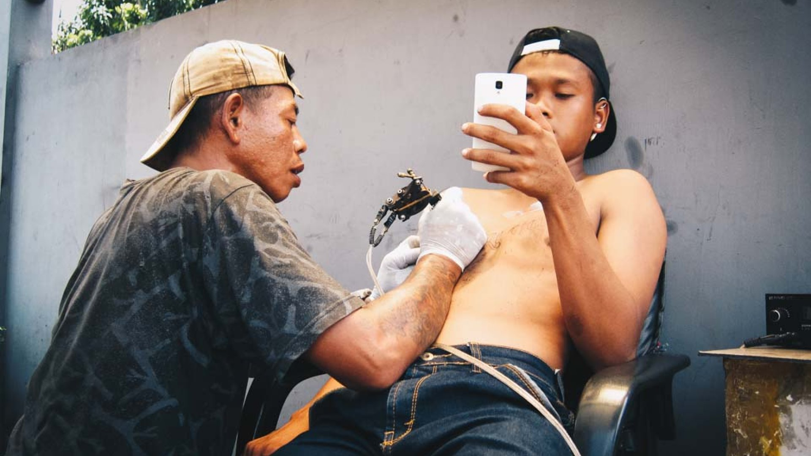

Project ini adalah salah satu project fotografi yang saya kerjakan pada tahun 2017, tepatnya saat campaign 24 Hour Project. Sayangnya saat itu saya ga ngikutin motret selama 24 jam, cuman setengah hari karena anak baru setahun lahir.



## Tentang 24 Hour Project

Campaign 24 Hour Project adalah project street photography yang dilakukan bagi pecinta street photography di seluruh dunia dengan tujuan sebagai awareness terhadap tema isu sosial yang sedang terjadi.

Setiap tahunnya 24 hour project memiliki tema yang berbeda-beda.

Uniknya, selain karena ini ga dapat reward apa-apa, tapi animo terhadap campaign ini cukup besar. Apalagi buat yang lagi pengen ketemu dengan street fotografer dari tempat yang berbeda di kotamu.

## Honorable Mention

Foto ini jadi salah satu foto favofit saya ketika melakukan project ini. Foto ini saya ambil di Blok M, Jakarta. [Cerita di balik foto](/blog/24-hour-project-street-tattoo/).
