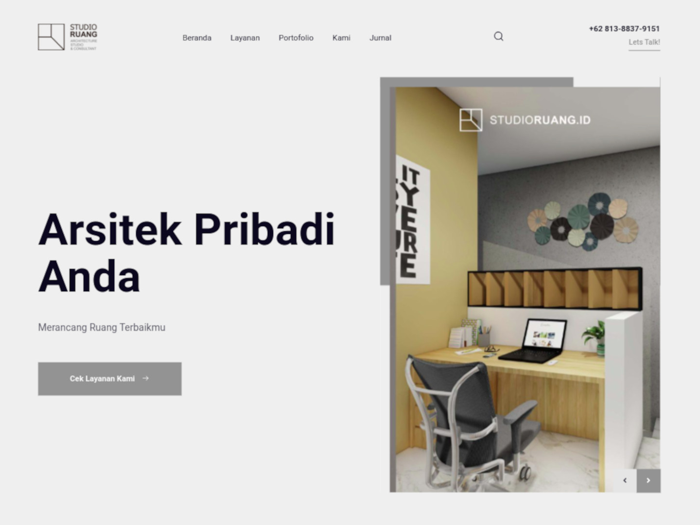
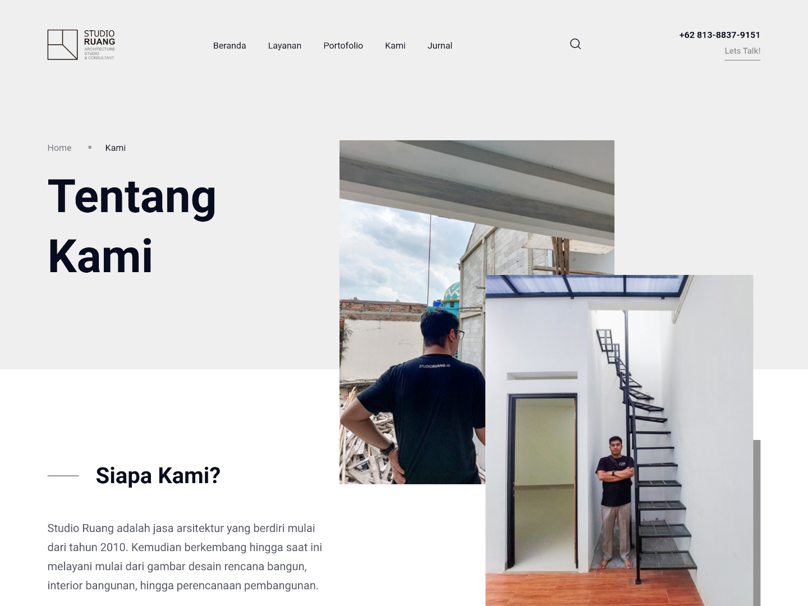
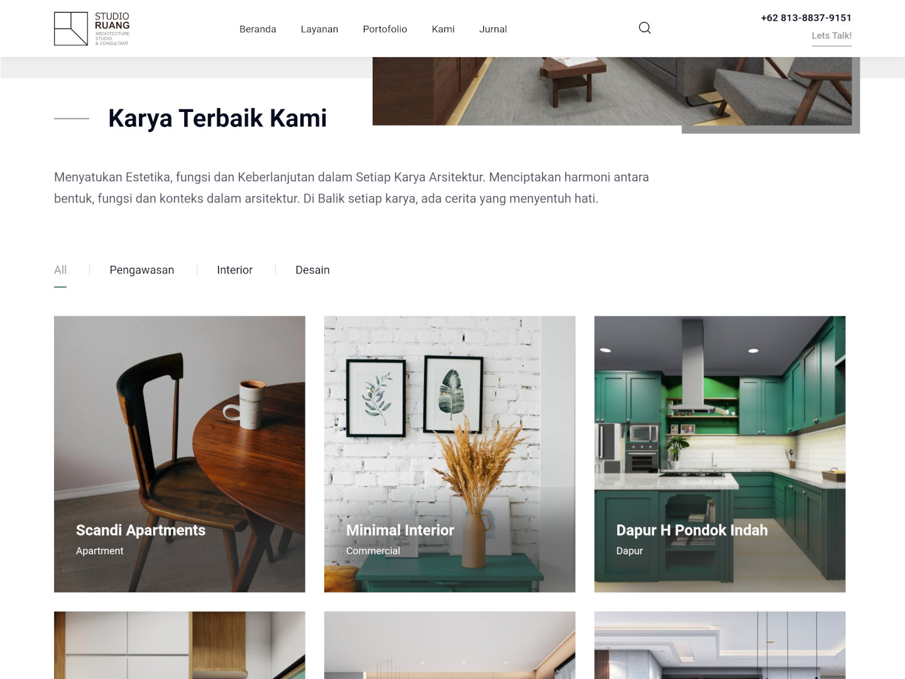
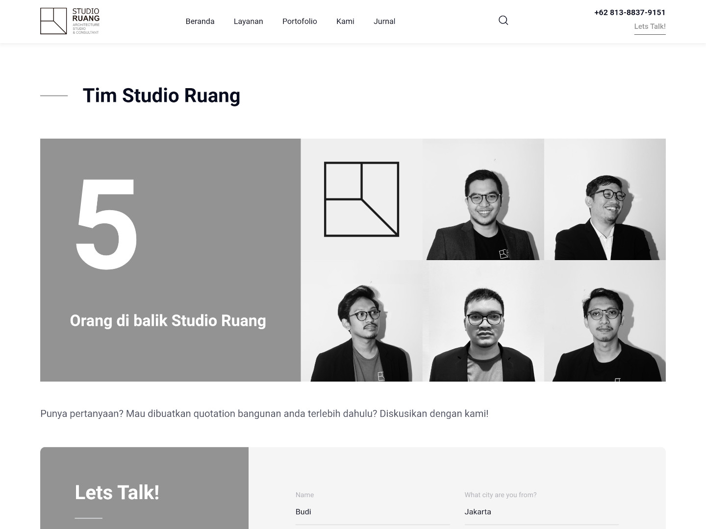

Project ini adalah project pembuatan website company profile untuk Studio Ruang Arsitektur yang berlokasi di Jakarta Barat.

## Tentang Website

Saya menggunakan Wordpress dan Elementor sebagai web builder untuk website company profile yang saya buat. Hostingnya saya serahkan pada hostingan lokal.

Website ini sendiri menggunakan template yang sudah ada sehingga pembuatannya cukup cepat kurang lebih memakan waktu selama seminggu. 

Selain pembuatan website, saya juga mengelola maintenancenya (backup dan update plugin), juga saya mengelola domain studioruang.id. 

## Tentang Studio Ruang

Diambil dari websitenya:

> Studio Ruang adalah jasa arsitektur yang berdiri mulai dari tahun 2010. Kemudian berkembang hingga saat ini melayani mulai dari gambar desain rencana bangun, interior bangunan, hingga perencanaan pembangunan.

## Gallery

[Cek Websitenya →](https://studioruang.id/)   